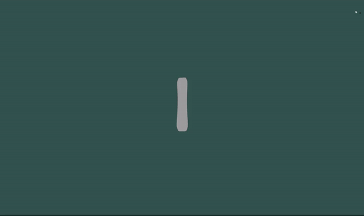

# RideRender

Currently a Work in Progress

Ultimately, this is a site for viewing 3D models of snowboards purchasable from a large retailer. 

Frontend is mostly complete, a couple things probably still need tweeking. 

Model generation is handled on the backend with python. Logic there is still the main blocker. Currently the models are only generated as single flat meshes, that I'm then doubling and applying some thickness to. 

*Issues as of 12/17/24*
* Model: Flat meshes make flat models. Still need to fix the tip and tail curvature for all generated models.
* Model: Clean up the edges on generated models. Models are generated from lower-than-desirable resolution images, causes some "spiking" along the edges
* Model: Texturing still needs to be done, hopefully won't be a huge issue. Might be done on the Frontend with three, might need to do at model generation.
* Frontend: Model is scaled too small on first render, only affects the first board chosen. Once zoomed in, other selected boards keep the same scaling. Just need to change the default scale.
* Frontend: Lower Priority; Can't cancel board selection without cancelling manufacturer selection. Not a huge deal, doesn't affect the site beyond user experience. 
